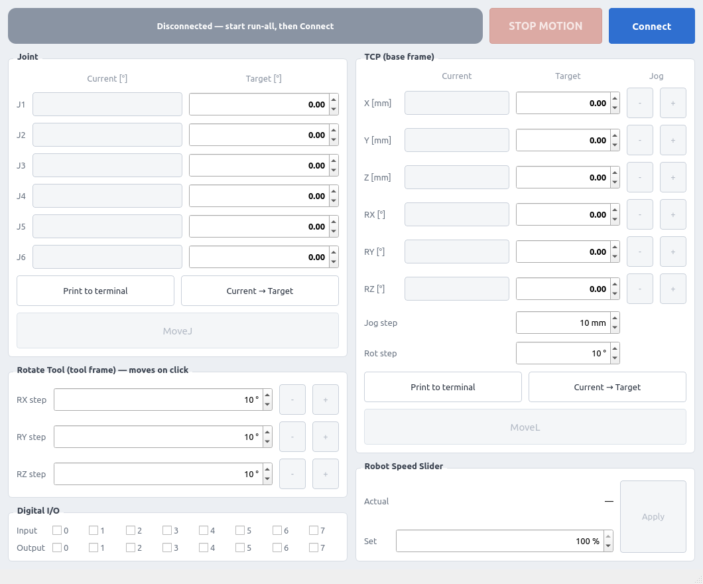

# Universal Robots ROS2<!-- omit from toc -->

**UR 협동로봇을 위한 ROS2 Humble 모션 제어 스택 — MoveIt2 기반 MoveJ/MoveL Action Server + C++/Python 클라이언트 라이브러리**

[](https://docs.ros.org/en/humble/)
[](https://moveit.picknik.ai/humble/index.html)
[](https://isocpp.org/)
[](https://www.python.org/)
[](docker/)
[](LICENSE)

---

## 목차<!-- omit from toc -->

- [데모](#데모)
- [개요](#개요)
  - [프로젝트 목적](#프로젝트-목적)
  - [주요 구성요소](#주요-구성요소)
  - [적용 가능 영역](#적용-가능-영역)
- [주요 기능](#주요-기능)
- [시스템 구조](#시스템-구조)
- [프로젝트 구조](#프로젝트-구조)
- [빠른 시작](#빠른-시작)
  - [Option 1: Docker (권장)](#option-1-docker-권장)
  - [Option 2: Native](#option-2-native)
- [시스템 요구사항](#시스템-요구사항)
  - [필수](#필수)
  - [하드웨어](#하드웨어)
  - [소프트웨어 의존성](#소프트웨어-의존성)
  - [외부 패키지](#외부-패키지)
- [설치](#설치)
  - [Method 1: Docker (권장)](#method-1-docker-권장)
  - [Method 2: Native](#method-2-native)
- [빌드](#빌드)
  - [전체 빌드](#전체-빌드)
  - [특정 패키지 빌드](#특정-패키지-빌드)
  - [클린 빌드](#클린-빌드)
- [실행](#실행)
  - [전체 시스템 실행 (권장)](#전체-시스템-실행-권장)
  - [개별 실행 (디버깅용)](#개별-실행-디버깅용)
  - [예제 실행](#예제-실행)
  - [GUI 실행 (ur_motion_panel)](#gui-실행-ur_motion_panel)
  - [Docker Commands](#docker-commands)
- [사용법](#사용법)
  - [워크플로우](#워크플로우)
  - [1. (실제 로봇, 최초 1회) 캘리브레이션 추출](#1-실제-로봇-최초-1회-캘리브레이션-추출)
  - [2. 실제 로봇 준비 (Teach Pendant)](#2-실제-로봇-준비-teach-pendant)
  - [3. Python 클라이언트 사용](#3-python-클라이언트-사용)
  - [4. C++ 클라이언트 사용](#4-c-클라이언트-사용)
  - [5. Program Watchdog 동작](#5-program-watchdog-동작)
- [설정](#설정)
  - [컨트롤러 설정 (`ur_controllers.yaml`)](#컨트롤러-설정-ur_controllersyaml)
  - [Kinematics 캘리브레이션 (`calibration_kinematics.yaml`)](#kinematics-캘리브레이션-calibration_kinematicsyaml)
  - [Docker 설정 (`docker/config.sh`)](#docker-설정-dockerconfigsh)
  - [Launch 인자](#launch-인자)
- [API / 인터페이스](#api--인터페이스)
  - [ROS2 액션 (ur_motion 제공)](#ros2-액션-ur_motion-제공)
  - [URRobotClient 주요 API](#urrobotclient-주요-api)
  - [주요 Topics / Services](#주요-topics--services)
  - [네트워크 구성](#네트워크-구성)
- [문제 해결](#문제-해결)
  - [1. Action 서버를 찾을 수 없음](#1-action-서버를-찾을-수-없음)
  - [2. 로봇 연결 실패](#2-로봇-연결-실패)
  - [3. e-stop / Local 모드로 제어권을 잃음](#3-e-stop--local-모드로-제어권을-잃음)
  - [4. I/O 서비스 사용 불가](#4-io-서비스-사용-불가)
  - [5. MoveL 실패](#5-movel-실패)
  - [6. TCP Pose를 가져올 수 없음](#6-tcp-pose를-가져올-수-없음)
  - [7. RViz가 표시되지 않음 (Docker)](#7-rviz가-표시되지-않음-docker)
- [라이선스](#라이선스)
- [Maintainer](#maintainer)

---

## 데모

<details>
<summary>UR Motion Panel GUI</summary>



</details>

<details>
<summary>MoveJ / MoveL 모션 데모</summary>

<!-- docs/demo.gif 캡처 추가 예정 -->

</details>

---

## 개요

### 프로젝트 목적

UR 협동로봇(ur3 ~ ur30)을 ROS2 환경에서 손쉽게 제어하기 위한 모션 제어 스택. 공식 [UR ROS2 Driver](https://github.com/UniversalRobots/Universal_Robots_ROS2_Driver)와 MoveIt2를 래핑하고 그 위에 단순한 Action 인터페이스(`/move_j`, `/move_l`)와 클라이언트 라이브러리(`URRobotClient`)를 얹어, 복잡한 MoveIt API 호출 없이 몇 줄의 코드로 관절/직교 공간 모션과 속도, 디지털 I/O를 제어하는 구조.

상위 시스템(OPC UA 서버, MES, 비전 파이프라인 등)이 로봇 세부 구현을 몰라도 되도록 클라이언트 계층에서 추상화하며, e-stop·Local 모드 전환으로 제어권을 잃어도 물리 복구가 끝나면 자동으로 제어권을 회복하는 program watchdog을 C++/Python 클라이언트 양쪽에 내장.

### 주요 구성요소

- **ur_motion** (C++): MoveJ/MoveL Action Server. MoveIt2 백엔드로 충돌 회피 플래닝 후 궤적 실행
- **ur_robot_client** (C++): `URRobotClient` 클라이언트 라이브러리 + 예제 4종. 모션/속도/I/O/상태 조회 + program watchdog (자체 executor 스레드)
- **ur_robot_client_py** (Python): 동일 기능의 Python 클라이언트 라이브러리 (non-Node 클래스, Node 주입, async/await 기반) + program watchdog
- **ur_motion_panel** (C++/Qt6): `URRobotClient` 기반 조그 GUI. MoveJ, 6자유도 TCP 타겟 MoveL(base 좌표계 XYZ+회전벡터), XYZ/회전 조그(base·tool 프레임), STOP MOTION, 디지털 I/O, 스피드 슬라이더
- **ur_robot_driver_wrapper**: UR ROS2 Driver 브링업 래퍼 (드라이버 + 컨트롤러 + 대시보드)
- **ur_moveit_config_wrapper**: MoveIt2 설정/실행 래퍼
- **ur_description_wrapper**: URDF/Xacro + kinematics 캘리브레이션 설정

### 적용 가능 영역

- Pick & Place 등 산업용 매니퓰레이터 응용 개발
- 실제 UR 로봇 및 시뮬레이션(fake hardware) 환경 제어
- 상위 애플리케이션(OPC UA, 비전, PLC 등)과의 로봇 제어 연동
- 워크셀 서버(manipulator 모듈)의 로봇 제어 백엔드

---

## 주요 기능

**MoveJ / MoveL Action**: 관절 공간(MoveJ)·직교 공간 직선(MoveL) 모션을 ROS2 Action으로 제공하며 MoveIt2 플래닝·충돌 검사를 백엔드로 사용

**C++ / Python 클라이언트**: 동일 기능의 `URRobotClient` 클래스를 양쪽 언어로 제공하며 Action/Service 호출을 `moveJ()`, `setSpeedSlider()` 같은 메서드로 추상화

**Program Watchdog (자동 제어권 회복)**: e-stop·Local 모드로 external control 프로그램이 중단(또는 PAUSE)되면 로봇 복구 시점에 `resend_robot_program`을 자동 호출하여 스택 재시작 없이 제어권 회복 — C++/Python 클라이언트 공통 내장

**Speed Slider 제어**: 속도 슬라이더 설정과 실제 speed scaling 모니터링을 함께 제공 (설정값·적용값 분리 조회)

**Digital I/O 제어**: 표준/설정 가능/툴 디지털 입출력 18핀 읽기·쓰기

**TCP Pose 추적**: TF2 기반 실시간 TCP 포즈(4x4 T-matrix) 조회

**Kinematics 캘리브레이션**: 실제 로봇에서 고유 캘리브레이션 값을 추출하는 스크립트 제공

**조그 GUI (UR Motion Panel)**: 관절·TCP 6자유도(base 좌표계 XYZ+회전벡터) 모니터링과 타겟 이동, 스텝 조그(base 병진/회전·tool 회전), STOP MOTION, DIO·속도 제어를 갖춘 Qt6 조작 패널

**멀티 로봇 지원**: `namespace` / `tf_prefix` launch 인자로 같은 네트워크에서 복수 로봇 운영 가능

**Docker 지원**: ROS2 Humble + UR Driver + MoveIt2 포함 이미지와 빌드/실행 스크립트 제공

---

## 시스템 구조

```
┌─────────────────────────────────────────────────────────────────┐
│                        User Application                         │
│  ┌──────────────────────────┐  ┌──────────────────────────────┐ │
│  │  ur_robot_client (C++)   │  │  ur_robot_client_py (Python) │ │
│  │  URRobotClient           │  │  URRobotClient               │ │
│  └────────────┬─────────────┘  └──────────────┬───────────────┘ │
└───────────────┼───────────────────────────────┼─────────────────┘
                │  Action: /move_j, /move_l     │
                │  Service: set_io, set_speed_slider
                ▼                               ▼
┌─────────────────────────────────────────────────────────────────┐
│                     ur_motion (Action Server)                   │
│  MoveJ / MoveL ──► MoveIt2 Backend (Planning & Collision Check) │
└───────────────────────────────┬─────────────────────────────────┘
                                │ FollowJointTrajectory
                                ▼
┌─────────────────────────────────────────────────────────────────┐
│              ur_robot_driver_wrapper (UR ROS2 Driver)           │
│   scaled_joint_trajectory_controller / io_and_status_controller │
│   dashboard_client / robot_state_helper                         │
└───────────────────────────────┬─────────────────────────────────┘
                                │ RTDE / Dashboard (TCP/IP)
                                ▼
                  ┌──────────────────────────────┐
                  │   UR Robot (ur3 ~ ur30)      │
                  │   or Fake Hardware (sim)     │
                  └──────────────────────────────┘
```

**데이터 흐름**

[제어 흐름] moveJ/moveL → `/move_j`·`/move_l` Action → MoveIt2 플래닝 → UR Driver → Robot  
[상태 흐름] Robot → UR Driver → joint_states·TF·io_states·speed_scaling → URRobotClient  
[I/O 흐름] setDigitalOut/setSpeedSlider → io_and_status_controller Service → UR Driver  
[워치독 흐름] 프로그램 중단·PAUSE 감지 → 로봇 복구(RUNNING+NORMAL) 대기 → resend_robot_program → 제어권 회복

---

## 프로젝트 구조

```
Universal_Robots_ROS2/
├── all.launch.py                            # 통합 실행 (Driver + MoveIt + Motion Server)
├── common.launch.py                         # 공통 launch 인자 정의 (robot_ip, ur_type 등)
├── extract_robot_calibration.sh             # 로봇 kinematics 캘리브레이션 추출
│
├── .github/workflows/release.yml            # v* 태그 push 시 GitHub Release 자동 생성
├── docs/ur_motion_panel.png                 # GUI 스크린샷
│
├── docker/
│   ├── Dockerfile                           # ROS2 Humble + UR Driver + MoveIt2 이미지
│   ├── build.sh / run.sh                    # 이미지 빌드 / 컨테이너 실행 (재사용 지원)
│   ├── entrypoint.sh / commands.sh          # 컨테이너 초기화 + bash function 정의
│   └── config.sh.example                    # 사용자 설정 템플릿 (config.sh로 복사)
│
├── ur_robot_driver_wrapper/                 # UR ROS2 Driver 래퍼
│   ├── config/ur_controllers.yaml           # ros2_control 컨트롤러 설정
│   └── launch/                              # bringup / driver / controllers / dashboard
│
├── ur_moveit_config_wrapper/                # MoveIt2 설정 래퍼
│   ├── config/ur_servo.yaml                 # MoveIt Servo 설정
│   └── launch/ur_moveit.launch.py
│
├── ur_description_wrapper/                  # 로봇 모델 래퍼
│   ├── config/calibration_kinematics.yaml   # kinematics 캘리브레이션
│   └── urdf/ur.urdf.xacro
│
├── ur_motion/                               # Motion Action Server
│   ├── action/                              # MoveJ.action / MoveL.action 정의
│   ├── include/ur_motion/                   # MoveIt 백엔드, 변환 유틸
│   └── src/motion_action_server.cpp
│
├── ur_robot_client/                         # C++ 클라이언트 라이브러리
│   ├── include/ur_robot_client/ur_robot_client.hpp
│   └── src/                                 # 라이브러리 + 예제 4종
│
├── ur_robot_client_py/                      # Python 클라이언트 라이브러리
│   └── ur_robot_client_py/                  # URRobotClient + 예제 4종
│
└── ur_motion_panel/                         # Qt6 조그 GUI (URRobotClient 기반)
    └── src/                                 # mainwindow + setting_config + .ui
```

---

## 빠른 시작

### Option 1: Docker (권장)

```bash
# 1. 저장소 클론
git clone https://github.com/hhanoo/Universal_Robots_ROS2.git
cd Universal_Robots_ROS2/docker

# 2. 설정 파일 생성 (로봇 IP / UR 타입 등 환경값 입력)
cp config.sh.example config.sh

# 3. Docker 이미지 빌드
./build.sh

# 4. 컨테이너 실행 (X11 포워딩 포함)
./run.sh

# 5. 컨테이너 내부에서 빌드 + 통합 실행
build         # colcon build --symlink-install (Release)
run-all       # UR Driver + MoveIt + Motion Server
```

### Option 2: Native

```bash
# 1. 저장소 클론 (ROS2 워크스페이스의 src 아래)
cd ~/ros2_ws/src
git clone https://github.com/hhanoo/Universal_Robots_ROS2.git

# 2. 시스템 의존성 설치 (아래 '설치' 섹션 참조)

# 3. 빌드
cd ~/ros2_ws
source /opt/ros/humble/setup.bash
colcon build --symlink-install
source install/setup.bash

# 4. 실행 (시뮬레이션)
ros2 launch src/Universal_Robots_ROS2/all.launch.py \
    robot_ip:=127.0.0.1 ur_type:=ur10e use_fake_hardware:=true
```

---

## 시스템 요구사항

### 필수

| 항목   | 요구사항                  |
| ------ | ------------------------- |
| OS     | Ubuntu 22.04 LTS          |
| ROS2   | Humble                    |
| C++    | C++17 (GCC 9+, Clang 10+) |
| Python | 3.10                      |

### 하드웨어

| 항목     | 사양                                            | 비고                             |
| -------- | ----------------------------------------------- | -------------------------------- |
| Robot    | UR ur3/ur3e/ur5/ur5e/ur10/ur10e/ur16e/ur20/ur30 | `ur_type` 인자 (기본: ur10e)     |
| 제어 PC  | Ubuntu 22.04, 멀티코어, 로봇과 같은 서브넷      | 시뮬레이션만 사용 시 로봇 불필요 |
| 네트워크 | 유선 이더넷 권장                                | 예시 로봇 IP: `192.168.1.25`     |

### 소프트웨어 의존성

**ROS2 패키지:**

- `ros-humble-ur` — UR 공식 드라이버 (ur_msgs, ur_dashboard_msgs, ur_calibration 포함)
- `ros-humble-ros2-control` / `ros-humble-ros2-controllers` — 컨트롤러 프레임워크
- MoveIt2 (Humble) — 모션 플래닝 (`ros-humble-ur` 의존성으로 함께 설치)

**Python 라이브러리:**

- `numpy`, `scipy` — Python 클라이언트의 행렬/회전 연산

### 외부 패키지

| 패키지                       | 출처 (버전)                                                                             | 용도                    |
| ---------------------------- | --------------------------------------------------------------------------------------- | ----------------------- |
| Universal_Robots_ROS2_Driver | humble (apt), [GitHub](https://github.com/UniversalRobots/Universal_Robots_ROS2_Driver) | UR 공식 ROS2 드라이버   |
| MoveIt2                      | humble (apt), [문서](https://moveit.picknik.ai/humble/index.html)                       | 모션 플래닝 / 충돌 검사 |

---

## 설치

### Method 1: Docker (권장)

Docker 이미지에 모든 의존성(UR Driver, MoveIt2, ros2_control 등)이 포함되어 있어 한 번의 빌드로 환경 준비가 끝나는 구성.

```bash
# 0. 프로젝트의 docker 디렉토리로 이동
cd Universal_Robots_ROS2/docker

# 1. 설정 파일 생성 (로봇 IP / UR 타입 등 사용 환경값 입력)
cp config.sh.example config.sh
# config.sh 편집

# 2. Docker 이미지 빌드
./build.sh

# 3. 컨테이너 실행
./run.sh
```

[run.sh](docker/run.sh)가 자동으로 처리하는 항목:

- [config.sh](docker/config.sh.example)가 없으면 example에서 자동 생성 (config.sh는 git 미추적)
- `--network host` / `--ipc host` / `--privileged`: 로봇 및 타 노드와 직접 통신
- X11 포워딩 (RViz 등 GUI)
- 프로젝트 루트를 `/ros2_ws/src`로, `build`/`install`/`log`를 워크스페이스로 마운트
- 같은 이름의 컨테이너가 이미 있으면 새로 만들지 않고 재사용(attach)
- 종료 시 `HOST_UID`/`HOST_GID`로 워크스페이스 파일 소유권 복원

### Method 2: Native

#### 0. 프로젝트 클론

```bash
mkdir -p ~/ros2_ws/src && cd ~/ros2_ws/src
git clone https://github.com/hhanoo/Universal_Robots_ROS2.git
```

#### 1. ROS2 Humble 설치

[ROS2 Humble 공식 설치 가이드](https://docs.ros.org/en/humble/Installation.html) 참고.

#### 2. 시스템 의존성 설치

```bash
sudo apt update
sudo apt install -y \
  ros-humble-ur \
  ros-humble-ros2-control \
  ros-humble-ros2-controllers
```

---

## 빌드

### 전체 빌드

```bash
# Docker: /ros2_ws, Native: ~/ros2_ws
cd ~/ros2_ws
source /opt/ros/humble/setup.bash
colcon build --symlink-install
source install/setup.bash
```

### 특정 패키지 빌드

```bash
colcon build --packages-select ur_motion ur_robot_client ur_robot_client_py
```

### 클린 빌드

```bash
rm -rf build install log
colcon build --symlink-install
source install/setup.bash
```

---

## 실행

### 전체 시스템 실행 (권장)

UR Driver + MoveIt + Motion Action Server를 한 번에 실행.

```bash
# 실제 로봇
ros2 launch src/Universal_Robots_ROS2/all.launch.py \
    robot_ip:=192.168.1.25 ur_type:=ur10e use_fake_hardware:=false

# 시뮬레이션 (fake hardware)
ros2 launch src/Universal_Robots_ROS2/all.launch.py \
    robot_ip:=127.0.0.1 ur_type:=ur10e use_fake_hardware:=true
```

### 개별 실행 (디버깅용)

각 구성요소를 별도 터미널에서 순서대로 실행.

```bash
# 터미널 1: UR Driver
ros2 launch ur_robot_driver_wrapper bringup.launch.py \
    robot_ip:=192.168.1.25 ur_type:=ur10e use_fake_hardware:=false

# 터미널 2: MoveIt
ros2 launch ur_moveit_config_wrapper ur_moveit.launch.py ur_type:=ur10e

# 터미널 3: Motion Action Server
ros2 run ur_motion motion_action_server
```

### 예제 실행

단계 순서대로: 연결 점검 → 기본 모션 → I/O → 통합 시퀀스.

```bash
# C++ 예제
ros2 run ur_robot_client example_state       # 1. 읽기 전용 상태 모니터링 (연결 점검)
ros2 run ur_robot_client example_movej       # 2. MoveJ 모션
ros2 run ur_robot_client example_io_speed    # 3. I/O + 속도 제어
ros2 run ur_robot_client example_pick_place  # 4. Pick & Place 통합

# Python 예제
ros2 run ur_robot_client_py example_state
ros2 run ur_robot_client_py example_movej
ros2 run ur_robot_client_py example_io_speed
ros2 run ur_robot_client_py example_pick_place
```

### GUI 실행 (ur_motion_panel)

UR 스택과 같은 컨테이너에서 실행 (별도 DDS 설정 불요).

> **필수**: GUI에서 **Connect 버튼을 누르기 전에** `run-all`(UR Driver + MoveIt + Motion Server) 전체 스택이 먼저 실행·연결 완료되어 있어야 함.  
> 스택이 없으면 Connect가 약 2초 폴링 후 실패.

```bash
# 터미널 1: ./run.sh → run-all       (스택 실행)
# 터미널 2: ./run.sh → run-panel   (기존 컨테이너에 attach 후 GUI 실행)
ros2 run ur_motion_panel ur_motion_panel
```

- **Joint**: 관절 6축 현재값 모니터링과 타겟 입력 후 MoveJ 실행
- **TCP (base frame)**: base 좌표계 6자유도 pose(XYZ[mm] + 회전벡터 RX/RY/RZ[°], UR 펜던트와 같은 표기)를 표시하며, 타겟을 입력해 MoveL 하거나 축별 ± 버튼으로 즉시 조그(병진 Jog step / 회전 Rot step, base 회전은 위치 고정)
- **Rotate Tool (tool frame)**: 툴 좌표계 기준 축별 스텝 회전 (클릭 즉시 이동)
- MoveJ는 연결만으로 활성화되고, MoveL·조그·회전은 TCP pose 수신이 필요 (fake hardware 모드에서는 pose가 `N/A`로 표시되고 해당 버튼 비활성)
- 이동 중에는 **STOP MOTION** 버튼으로 진행 중인 모션을 즉시 취소(`moveCancel`) — 소프트웨어 취소이며 비상정지 아님
- **Robot Speed Slider**: Actual은 로봇이 보고하는 실측 speed scaling, Set은 Apply 버튼을 눌러야 적용. 모션은 항상 풀속도로 계획되고 실제 속도는 슬라이더가 결정 (fake hardware에서는 슬라이더 서비스가 없어 속도 조절 불가)
- 상단 상태 pill이 Disconnected/Connected/Moving과 펜던트 Local 모드 경고를 표시
- GUI 설정은 `install/ur_motion_panel/lib/ur_motion_panel/config.ini`에 저장 (마운트된 `install/` 안이라 컨테이너 재생성 후에도 유지)

### Docker Commands

> 권장: 직접 `docker exec`로 컨테이너에 진입하지 말고 항상 [run.sh](docker/run.sh)를 사용할 것.  
> `run.sh`가 이미지 확인 · X11 권한 · 마운트 · 파일 소유권 복원(`HOST_UID`/`HOST_GID`) · 기존 컨테이너 재사용을 한 번에 처리.

전체 command 정의는 [commands.sh](docker/commands.sh)를 참고하세요.

| Command              | 설명                                            | 참고                                                                                     |
| -------------------- | ----------------------------------------------- | ---------------------------------------------------------------------------------------- |
| `build`              | colcon Release 빌드 + overlay source            | —                                                                                        |
| `build-debug`        | 디버그 심볼 포함 빌드 (RelWithDebInfo)          | —                                                                                        |
| `debug-motion`       | motion_action_server를 gdbserver `:3000`로 실행 | —                                                                                        |
| `debug-panel`        | ur_motion_panel를 gdbserver `:3000`로 실행      | —                                                                                        |
| `extract-calib`      | UR kinematics 캘리브레이션 추출 (`ROBOT_IP`)    | [calibration_kinematics.yaml](ur_description_wrapper/config/calibration_kinematics.yaml) |
| `run-ur`             | UR Driver 단독 실행                             | [bringup.launch.py](ur_robot_driver_wrapper/launch/bringup.launch.py)                    |
| `run-moveit`         | MoveIt 단독 실행                                | [ur_moveit.launch.py](ur_moveit_config_wrapper/launch/ur_moveit.launch.py)               |
| `run-motion`         | Motion Action Server 단독 실행                  | [motion_action_server.cpp](ur_motion/src/motion_action_server.cpp)                       |
| `run-all`            | Driver + MoveIt + Motion 통합 실행              | [all.launch.py](all.launch.py)                                                           |
| `run-panel`          | UR Motion Panel 실행 (`run-all` 선행 필수)      | [mainwindow.cpp](ur_motion_panel/src/mainwindow.cpp)                                     |
| `example-state`      | 1. C++ 읽기 전용 상태 모니터링 (연결 점검)      | [example_state.cpp](ur_robot_client/src/example_state.cpp)                               |
| `example-movej`      | 2. C++ MoveJ 예제 실행                          | [example_movej.cpp](ur_robot_client/src/example_movej.cpp)                               |
| `example-io`         | 3. C++ I/O + 속도 제어 예제 실행                | [example_io_speed.cpp](ur_robot_client/src/example_io_speed.cpp)                         |
| `example-pick-place` | 4. C++ Pick & Place 통합 예제 실행              | [example_pick_place.cpp](ur_robot_client/src/example_pick_place.cpp)                     |
| `source-config`      | `docker/config.sh` 재로딩                       | [config.sh.example](docker/config.sh.example)                                            |
| `cmd-help`           | 명령어 목록 + 현재 config 값 출력               | —                                                                                        |

---

## 사용법

### 워크플로우

```
Run Stack ───▶ Calibrate ───▶ Connect ───▶ Control (Motion / I/O)
    │              │             │              │
all.launch.py  extract_robot_  waitRobotReady  moveJ / moveL
run-all        calibration.sh  isConnected     setSpeedSlider
               (real, once)                    setDigitalOut
```

### 1. (실제 로봇, 최초 1회) 캘리브레이션 추출

정확한 TCP 위치를 위해 로봇 고유의 kinematics 캘리브레이션을 추출하는 단계.

```bash
# 스크립트 내부의 ROBOT_IP를 실제 로봇 IP로 수정 후 실행 (Docker에서는 extract-calib)
./extract_robot_calibration.sh
# 결과: ur_description_wrapper/config/calibration_kinematics.yaml
```

### 2. 실제 로봇 준비 (Teach Pendant)

1. 로봇 전원 켜기 및 브레이크 해제
2. `External Control` URCap 프로그램 실행 (호스트 PC IP 지정)
3. Remote Control 모드로 전환

### 3. Python 클라이언트 사용

모션·서비스 API는 코루틴이라 `await`로 호출 (스핀 루프 포함 전체 패턴은 [ur_robot_client_py/README.md](ur_robot_client_py/README.md) 참고).

```python
import rclpy
from rclpy.node import Node
from ur_robot_client_py import URRobotClient

rclpy.init()
node = Node('my_controller')
robot = URRobotClient(node)  # Node 주입, 스핀은 호출자 책임

# 상태 수신 준비 대기
await robot.wait_robot_ready(timeout=10.0)

# 관절 공간 모션 — (success, message) 반환
success, msg = await robot.move_j([0.0, -1.57, 1.57, -1.57, -1.57, 0.0], velocity=0.5)

# 속도 및 I/O
await robot.set_speed_slider(0.5)
await robot.set_digital_out(0, True)

# TCP 포즈 (4x4 행렬)
if robot.is_tcp_pose_available():
    tcp = robot.get_tcp_pose()
```

### 4. C++ 클라이언트 사용

클라이언트가 자체 executor로 스핀하므로 생성만 하면 되고, 모션 API는 `std::future`를 반환 (전체 패턴은 [ur_robot_client/README.md](ur_robot_client/README.md) 참고).

```cpp
#include "ur_robot_client/ur_robot_client.hpp"

// 생성만 하면 자체 executor 스레드가 스핀 — 외부 spin 금지
auto client = std::make_shared<URRobotClient>();
client->waitRobotReady(5.0);

std::vector<double> home = {0.0, -1.57, 1.57, -1.57, -1.57, 0.0};
auto result = client->moveJ(home, 0.5).get();  // .get() = 완료 대기

client->setSpeedSlider(0.5).get();
client->setDigitalOut(0, true).get();
```

자세한 API는 [ur_robot_client/README.md](ur_robot_client/README.md), [ur_robot_client_py/README.md](ur_robot_client_py/README.md)를 참고하세요.

### 5. Program Watchdog 동작

`URRobotClient`(C++/Python 공통)는 500ms 주기 watchdog으로 external control 프로그램 상태를 감시.

- 프로그램 중단(e-stop·Local 전환) 또는 PAUSE 의심(safety mode가 NORMAL 이탈) 시 복구 감시 시작
- 작업자가 물리 복구(비상정지 해제, Remote 전환)를 완료해 robot mode `RUNNING` + safety mode `NORMAL`이 되면 자동으로 `resend_robot_program`을 호출하여 제어권 회복 (3초 간격 재시도, 응답 10초 타임아웃)
- e-stop은 프로그램을 정지가 아닌 PAUSE 상태로 남길 수 있어 `robot_program_running`이 true여도 복구를 시도하며, PAUSE 복구 완료 판정은 Pendant가 Remote 모드임을 확인한 뒤에만 확정
- Local 전환으로 dashboard_client TCP 소켓이 끊기면 `/dashboard_client/connect`로 자동 재연결 (30초 간격)
- 물리적 복구(`unlock_protective_stop`, `power_on`, 브레이크 해제 등)는 안전상 절대 자동 호출하지 않으며 작업자 몫
- Pendant가 Local 모드이면 "Pendant is in LOCAL mode" 경고 로그로 안내
- fake hardware(`use_fake_hardware:=true`)에서는 상태 토픽이 발행되지 않아 watchdog이 자동 휴면
- `isProgramRunning()` / `is_program_running()`으로 현재 제어권 상태 조회 가능

---

## 설정

### 컨트롤러 설정 (`ur_controllers.yaml`)

[ur_robot_driver_wrapper/config/ur_controllers.yaml](ur_robot_driver_wrapper/config/ur_controllers.yaml)에서 ros2_control 컨트롤러를 정의.

```yaml
# 기본 모션 컨트롤러: scaled_joint_trajectory_controller (update_rate: 125Hz)
# I/O·속도·프로그램 상태: io_and_status_controller
```

### Kinematics 캘리브레이션 (`calibration_kinematics.yaml`)

```bash
# 실제 로봇에서 추출 (extract_robot_calibration.sh 참고)
ros2 launch ur_calibration calibration_correction.launch.py \
    robot_ip:=<ROBOT_IP> \
    target_filename:=<...>/ur_description_wrapper/config/calibration_kinematics.yaml
```

### Docker 설정 (`docker/config.sh`)

[config.sh.example](docker/config.sh.example)을 복사해 사용하며 git에는 추적되지 않는 파일.

```bash
IMAGE_NAME="universal-robots-ros2:latest"
CONTAINER_NAME="universal-robots-ros2"
ROS_DOMAIN_ID="98"                       # DDS 도메인 (동일 네트워크의 타 시스템과 분리)
XAUTHORITY_PATH="$HOME/.Xauthority"      # X11 인증 파일 (RViz 표시용)

# UR 로봇 (컨테이너 내부 run-* command가 사용)
ROBOT_IP="127.0.0.1"                     # 또는 실제 로봇 IP (예: 192.168.1.25)
UR_TYPE="ur10e"
USE_FAKE_HARDWARE="false"
LAUNCH_RVIZ="true"
```

### Launch 인자

[common.launch.py](common.launch.py)에서 정의하며 모든 launch 파일이 공유.

| 인자                 | 기본값                        | 설명                                  |
| -------------------- | ----------------------------- | ------------------------------------- |
| `robot_ip`           | `127.0.0.1`                   | UR 로봇 IP (시뮬레이션은 `127.0.0.1`) |
| `ur_type`            | `ur10e`                       | 로봇 모델 (ur3 ~ ur30)                |
| `use_fake_hardware`  | `false`                       | 시뮬레이션 모드 여부                  |
| `kinematics_params`  | `calibration_kinematics.yaml` | kinematics 캘리브레이션 파일 경로     |
| `namespace`          | `""`                          | 멀티 로봇용 네임스페이스              |
| `tf_prefix`          | `""`                          | 멀티 로봇용 TF prefix                 |
| `launch_moveit_rviz` | `true`                        | MoveIt RViz 실행 여부                 |

---

## API / 인터페이스

### ROS2 액션 (ur_motion 제공)

| Action    | 타입                     | 설명                                                           |
| --------- | ------------------------ | -------------------------------------------------------------- |
| `/move_j` | `ur_motion/action/MoveJ` | 관절 공간 모션. Goal: 관절값 6개(rad) + 속도 스케일 [0.05~1.0] |
| `/move_l` | `ur_motion/action/MoveL` | 직교 공간 직선 모션. Goal: 4x4 T-matrix(row-major 16개) + 속도 |

### URRobotClient 주요 API

| 기능           | C++                                        | Python                                         |
| -------------- | ------------------------------------------ | ---------------------------------------------- |
| 관절 모션      | `moveJ(joints, velocity)`                  | `move_j(joints, velocity)`                     |
| 직선 모션      | `moveL(tmatrix, velocity)`                 | `move_l(tmatrix, velocity)`                    |
| 모션 취소      | `moveCancel()`                             | `move_cancel()`                                |
| 속도 설정      | `setSpeedSlider(fraction)`                 | `set_speed_slider(value)`                      |
| 속도 조회      | `getSpeedSlider()` / `getSpeedScaling()`   | `get_speed_slider()` / `get_speed_scaling()`   |
| 디지털 출력    | `setDigitalOut(pin, value)`                | `set_digital_out(pin, value)`                  |
| 디지털 조회    | `getDigitalIn(pin)` / `getDigitalOut(pin)` | `get_digital_in(pin)` / `get_digital_out(pin)` |
| 관절 조회      | `getJointPositions()`                      | `get_joint_positions()`                        |
| TCP 포즈       | `getTcpPose()`                             | `get_tcp_pose()`                               |
| 연결/준비      | `isConnected()` / `waitRobotReady()`       | `is_connected()` / `wait_robot_ready()`        |
| 제어권 상태    | `isProgramRunning()`                       | `is_program_running()`                         |
| 로봇/안전 모드 | `getRobotMode()` / `getSafetyMode()`       | `get_robot_mode()` / `get_safety_mode()`       |
| Pendant 모드   | `isRemoteControl()`                        | `is_remote_control()`                          |

상세 시그니처와 사용 패턴은 [ur_robot_client/README.md](ur_robot_client/README.md), [ur_robot_client_py/README.md](ur_robot_client_py/README.md) 참고.

### 주요 Topics / Services

| 이름                                              | 타입         | 설명                                           |
| ------------------------------------------------- | ------------ | ---------------------------------------------- |
| `/joint_states`                                   | Topic (구독) | 관절 상태                                      |
| `/speed_scaling_state_broadcaster/speed_scaling`  | Topic (구독) | 실제 속도 스케일링                             |
| `/io_and_status_controller/io_states`             | Topic (구독) | 디지털 I/O 상태                                |
| `/io_and_status_controller/robot_program_running` | Topic (구독) | External control 프로그램 실행 여부 (watchdog) |
| `/io_and_status_controller/robot_mode`            | Topic (구독) | 로봇 모드 (watchdog)                           |
| `/io_and_status_controller/safety_mode`           | Topic (구독) | 안전 모드 (watchdog)                           |
| `/io_and_status_controller/set_io`                | Service      | 디지털 출력 설정                               |
| `/io_and_status_controller/set_speed_slider`      | Service      | 속도 슬라이더 설정                             |
| `/io_and_status_controller/resend_robot_program`  | Service      | 제어 프로그램 재전송 (제어권 회복)             |
| `/dashboard_client/is_in_remote_control`          | Service      | Remote/Local 모드 확인 (5초 폴링)              |
| `/dashboard_client/connect`                       | Service      | dashboard_client 소켓 재연결 (watchdog)        |

### 네트워크 구성

| 항목              | 값                 | 설명                                    |
| ----------------- | ------------------ | --------------------------------------- |
| 로봇 IP           | 예: `192.168.1.25` | `robot_ip` 인자로 지정                  |
| 시뮬레이션 IP     | `127.0.0.1`        | `use_fake_hardware:=true`와 함께 사용   |
| ROS_DOMAIN_ID     | `98`               | Docker 컨테이너 기본값                  |
| Dashboard         | TCP 29999          | UR Dashboard Server (드라이버가 사용)   |
| Primary/RTDE      | TCP 30001-30004    | UR 통신 인터페이스 (드라이버가 사용)    |
| Reverse Interface | TCP 50001-50004    | External Control URCap ↔ 호스트 PC 통신 |

---

## 문제 해결

### 1. Action 서버를 찾을 수 없음

증상:

```
MoveJ action server not available
```

해결:

```bash
# Motion Action Server 실행 여부 확인 (/move_j, /move_l 존재해야 함)
ros2 action list

# 없으면 실행
ros2 run ur_motion motion_action_server
```

### 2. 로봇 연결 실패

증상:

```
Failed to connect to robot
```

해결:

```bash
# UR Driver 실행 여부 확인 (/joint_states 존재해야 함)
ros2 topic list | grep joint_states

# 실제 로봇: ping 및 External Control URCap 실행 여부 확인
ping 192.168.1.25
```

### 3. e-stop / Local 모드로 제어권을 잃음

증상:

```
Robot program stopped - control lost
```

해결: e-stop이 눌리거나 Pendant가 Remote → Local로 전환되면 external control 프로그램이 멈추고 드라이버가 제어권을 잃는 상황. 작업자가 물리적 복구(비상정지 해제, 전원/브레이크 해제, Remote 전환)를 마치면 `URRobotClient`(C++/Python 공통) 내장 watchdog이 `resend_robot_program`을 호출해 자동으로 제어권을 재획득하므로 스택 재시작은 불필요.

```bash
# 현재 제어권 상태 확인
ros2 topic echo /io_and_status_controller/robot_program_running --once
```

> Pendant가 Local 모드이면 `resend_robot_program`이 성공해도 프로그램이 실행되지 않습니다. Remote 모드로 전환하세요.

### 4. I/O 서비스 사용 불가

증상:

```
I/O service not available
```

해결:

```bash
# io_and_status_controller 활성화 확인
ros2 service list | grep set_io
ros2 control list_controllers
```

### 5. MoveL 실패

증상:

```
MoveL failed
```

해결:

- 목표 위치가 로봇 작업 공간 내에 있는지 확인
- RViz에서 충돌 여부 확인
- 속도를 낮춰 재시도 (`velocity:=0.2`)

### 6. TCP Pose를 가져올 수 없음

증상:

```
is_tcp_pose_available() == false
```

해결:

```bash
# TF 트리에 base -> tool0_controller가 있는지 확인
ros2 run tf2_tools view_frames
```

> `tool0_controller` 프레임은 실제 UR 드라이버(또는 URSim)만 발행하며, fake hardware에서는 발행되지 않습니다.

### 7. RViz가 표시되지 않음 (Docker)

증상:

```
qt.qpa.xcb: could not connect to display
```

해결:

```bash
# 호스트에서 X11 접근 허용 후 컨테이너 재실행 (run.sh가 자동 수행)
xhost +local:docker
./docker/run.sh
```

---

## 라이선스

이 프로젝트는 Apache-2.0 라이선스로 배포됩니다. 자세한 내용은 [LICENSE](LICENSE) 파일을 참조하세요.

> 예외: [ur_moveit_config_wrapper](ur_moveit_config_wrapper/)의 [ur_moveit.launch.py](ur_moveit_config_wrapper/launch/ur_moveit.launch.py)와 [launch_common.py](ur_moveit_config_wrapper/ur_moveit_config_wrapper/launch_common.py)는 PickNik, Inc.의 BSD-3-Clause 코드에서 파생되어 원 저작권 고지를 유지합니다.

---

## Maintainer

**hhanoo** (woo980711@gmail.com)
